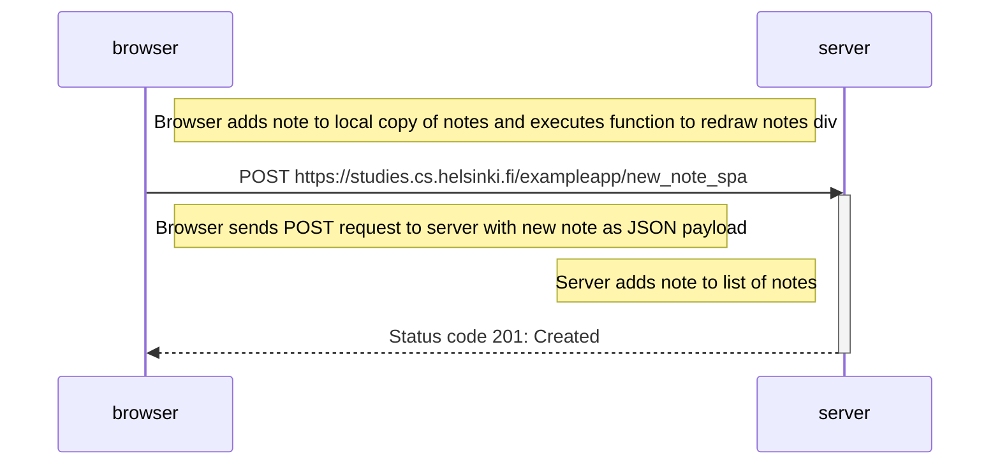

```mermaid
sequenceDiagram
    participant browser
    participant server

    Note right of browser: Browser adds note to local copy of notes and executes function to redraw notes div
    browser->>server: POST https://studies.cs.helsinki.fi/exampleapp/new_note_spa
    activate server
    Note right of browser: Browser sends POST request to server with new note as JSON payload
    Note left of server: Server adds note to list of notes 
    server-->>browser: Status code 201: Created
    deactivate server
```